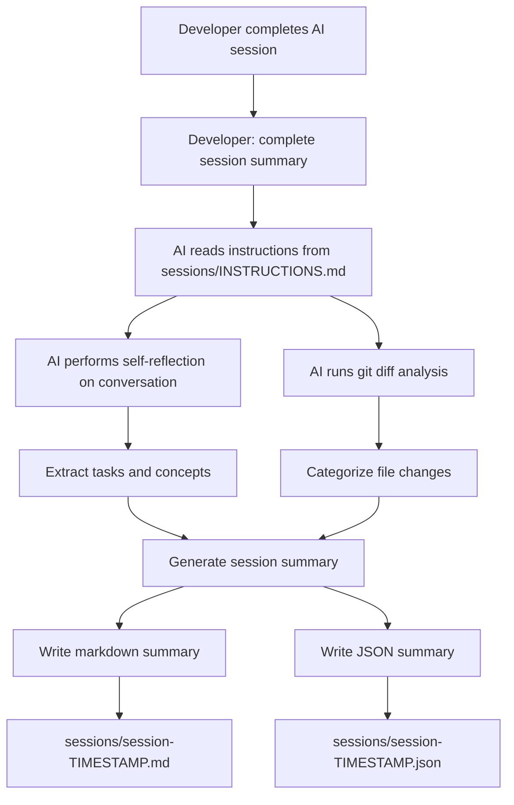

# AI Session Summary Tool - Implementation Plan

## Overview
A model-agnostic tool that captures AI-assisted development sessions, providing developers with clear visibility into tasks completed, concepts learned, and file changes made. The tool enables session continuity and helps developers maintain control over AI-assisted changes.

## Core Requirements

### 1. Session Summary Content
Each session summary must include:
- **Tasks Completed**: List of specific tasks accomplished during the session. This should be a brief summary, 5 bullet points or less if possible.
- **Concepts Covered**: Foundational understanding of new concepts, patterns, or technologies. If external sources have been referenced by the model, include website links, clickable links to peer-reviewed papers only if they are relevant to the topic, links to external github repos so that the developer can review the concepts themselves. Foundational knowlegde should be covered, starting from the most basic level and increasing in difficulty. No more than 10 bullet points. 
- **Files Read**: List of files that were examined (read-only access). If no files have been read in the session, so say.
- **Files Modified**: Detailed changes made to files with diffs. Why were these files changed? Brief summary of the change, followed by a snapshot of the code that has been updated. If no files have been edited in the session, say so.
- **Prerequisites**: Information needed to continue work in future sessions
- **Session Metadata**: Timestamp, topic, duration, AI model used (if detectable), token count

### 2. Output Formats
- **Markdown**: Human-readable format for quick review and documentation
- **JSON**: Machine-readable format for programmatic parsing and tooling integration

### 3. Storage Location
- Sessions stored in `sessions/` directory (version controlled but hidden)
- Naming convention: `session-name-YYYY-MM-DD-HHMMSS.md` and `.json` where name is a one or two word description of the topic.
- Configuration file: `config.json` for token thresholds and other settings

## Architecture



## Implementation Components

### 1. Project Structure
```
sessions/
├── INSTRUCTIONS.md          # Instructions for AI to generate summaries
├── TEMPLATE.md              # Template structure for summaries
├── schema.json              # JSON schema for machine-readable output
├── config.json              # Configuration for token thresholds and settings
├── .session-state.json      # Current session state (token count, start time)
├── session-2026-06-04-114500.md
├── session-2026-06-04-114500.json
└── index.json               # Index of all sessions
```

### 2. INSTRUCTIONS.md
Comprehensive guide for AI models containing:
- Step-by-step process to generate session summary
- How to analyze conversation history
- Git commands to run for file change detection
- Template to follow for output
- Examples of good summaries
- Model-agnostic language (works with any AI)

### 3. CLI Tool (Optional Enhancement)
Simple Node.js/Python script for:
- `session-summary init` - Initialize session tracking
- `session-summary start` - Mark session start (capture git state)
- `session-summary end` - Trigger summary generation
- `session-summary list` - List all sessions
- `session-summary load <id>` - Load previous session context

### 4. Git Integration
The tool will use git to:
- Detect all file changes since session start
- Generate diffs for modified files
- Identify new files created
- Track deleted files
- Distinguish between read and modified files (via AI reflection)

### 5. Session Summary Schema

#### Markdown Structure
```markdown
# AI Session Summary
**Date**: YYYY-MM-DD HH:MM:SS
**Duration**: X minutes
**AI Model**: [Model name if known]
**Token Count**: X tokens (Y% of threshold)

## Tasks Completed
- Task 1
- Task 2

## Concepts Covered
### Concept Name
Brief explanation...

## Files Accessed

### Read Only
- `path/to/file1.ts` - Purpose of reading

### Modified
- `path/to/file2.ts` - What was changed and why

### Created
- `path/to/file3.ts` - Purpose of new file

### Deleted
- `path/to/file4.ts` - Reason for deletion

## Detailed File Changes

### path/to/file2.ts
**Changes Made**: Description
**Reason**: Why these changes were necessary

```diff
[git diff output]
```

## Prerequisites for Continuation
- Context needed to continue
- Dependencies or setup required
- Current state of work

## Next Steps
- Suggested next actions
```

#### JSON Structure
```json
{
  "sessionId": "uuid",
  "timestamp": "ISO-8601",
  "duration": "minutes",
  "aiModel": "string",
  "tokenCount": 0,
  "tokenThreshold": 100000,
  "tasks": ["task1", "task2"],
  "concepts": [
    {
      "name": "concept",
      "description": "explanation"
    }
  ],
  "files": {
    "read": ["path1"],
    "modified": [
      {
        "path": "path2",
        "changes": "description",
        "diff": "git diff output"
      }
    ],
    "created": ["path3"],
    "deleted": ["path4"]
  },
  "prerequisites": ["prereq1"],
  "nextSteps": ["step1"]
}
```

### 6. Session Continuation Feature
When loading a previous session:
- AI reads the session summary
- Understands context and state
- Can continue work seamlessly
- References previous decisions and rationale

## Implementation Steps

### Phase 1: Core Infrastructure
1. Create `sessions/` directory structure
2. Write comprehensive INSTRUCTIONS.md for AI models
3. Create TEMPLATE.md with example structure
4. Define JSON schema

### Phase 2: Git Integration
5. Document git commands for file change detection
6. Create helper scripts for git diff analysis
7. Test with various file change scenarios

### Phase 3: Summary Generation
8. Test instruction file with AI model
9. Generate example session summary
10. Refine template based on output quality

### Phase 4: Enhancement
11. Add CLI tool for session management (optional)
12. Create index.json for session tracking
13. Add session search/filter capabilities

### Phase 5: Documentation
14. Write comprehensive README
15. Add usage examples
16. Document best practices

## Key Design Decisions

### Model Agnostic Approach
- Instructions written in clear, universal language
- No model-specific APIs or features required
- Works with any AI that can read files and execute commands
- Self-contained instructions in repository

### Git-Based Change Tracking
- Leverages existing version control
- Accurate file change detection
- Provides detailed diffs automatically
- No additional monitoring infrastructure needed

### Dual Format Output
- Markdown for human readability and quick review
- JSON for tooling integration and automation
- Both formats contain same information

### Version Control Integration
- `sessions/` directory is tracked in git
- Provides history of AI interactions
- Enables team collaboration and review
- Can be excluded via .gitignore if needed

## Success Criteria

1. **Clarity**: Summaries clearly explain what was done and why
2. **Completeness**: All file changes and concepts are captured
3. **Continuity**: Future sessions can resume work seamlessly
4. **Model Agnostic**: Works with any AI assistant
5. **Low Friction**: Simple command to generate summary
6. **Useful**: Provides real value for code review and understanding

## Token Monitoring Feature

### Overview
To prevent context window degradation and maintain AI response quality, the tool includes token threshold monitoring. This feature helps developers know when to end a session and start fresh with a summary.

### Implementation Approach

#### Phase 1: Manual Threshold (Initial Release)
- **Configuration File**: `config.json` stores token threshold settings
- **Session State Tracking**: `.session-state.json` tracks current session token count
- **Manual Updates**: Developer manually updates token count or uses simple estimation
- **Threshold Alerts**: When approaching threshold (70-80%), AI suggests creating summary

#### Configuration Structure
```json
{
  "tokenThreshold": 100000,
  "warningThreshold": 0.7,
  "criticalThreshold": 0.85,
  "autoSuggestSummary": true,
  "defaultModel": "gpt-4"
}
```

#### Session State Structure
```json
{
  "sessionStartTime": "ISO-8601",
  "currentTokenCount": 45000,
  "lastUpdated": "ISO-8601",
  "sessionActive": true
}
```

### Usage Workflow

1. **Session Start**: Initialize with `session-summary start`
   - Creates `.session-state.json`
   - Records start time
   - Resets token count to 0

2. **During Session**: Periodic checks
   - Developer can manually update: `session-summary update-tokens 50000`
   - Or use estimation: `session-summary estimate-tokens`
   - Tool checks against thresholds

3. **Threshold Warnings**:
   - **70% (Warning)**: "Consider wrapping up current task"
   - **85% (Critical)**: "Strongly recommend creating session summary"
   - **100% (Limit)**: "Session summary required before continuing"

4. **Session End**: Generate summary
   - Run `session-summary end` or tell AI "complete session summary"
   - Token count included in summary metadata
   - State file archived or reset

### Best Practices for Session Boundaries

#### When to End a Session
- Approaching token threshold (70-85%)
- Completed a major feature or milestone
- Switching to a different task or context
- End of work day/session
- Before code review or PR creation

#### Session Size Guidelines
- **Small Sessions** (10K-30K tokens): Single feature, bug fix
- **Medium Sessions** (30K-70K tokens): Multiple related tasks
- **Large Sessions** (70K-100K tokens): Complex feature, refactoring
- **Avoid**: Sessions over 100K tokens (context degradation risk)

#### Token Estimation Tips
- Average message: 100-500 tokens
- Code file (500 lines): ~2000-3000 tokens
- Long conversation (20 exchanges): ~10K-20K tokens
- Use conservative estimates when unsure

### Future Enhancements (Phase 2)

#### API Integration
- **OpenAI API**: Direct token count from API responses
- **Anthropic API**: Claude token usage tracking
- **Other Models**: Plugin architecture for custom integrations

#### Advanced Features
- Automatic token counting via API hooks
- Real-time token usage display
- Predictive warnings based on conversation patterns
- Token usage analytics and trends
- Multi-model token tracking

#### VSCode Extension Integration
- Status bar token counter
- Visual threshold indicators
- Automatic summary suggestions
- One-click session management

## Future Enhancements

- Web UI for browsing sessions
- Integration with PR descriptions
- Automatic session detection via API integration
- Session comparison tool
- Export to other formats (PDF, HTML)
- Team collaboration features
- Session analytics and insights
- Real-time token monitoring with API integration
- VSCode extension for seamless integration